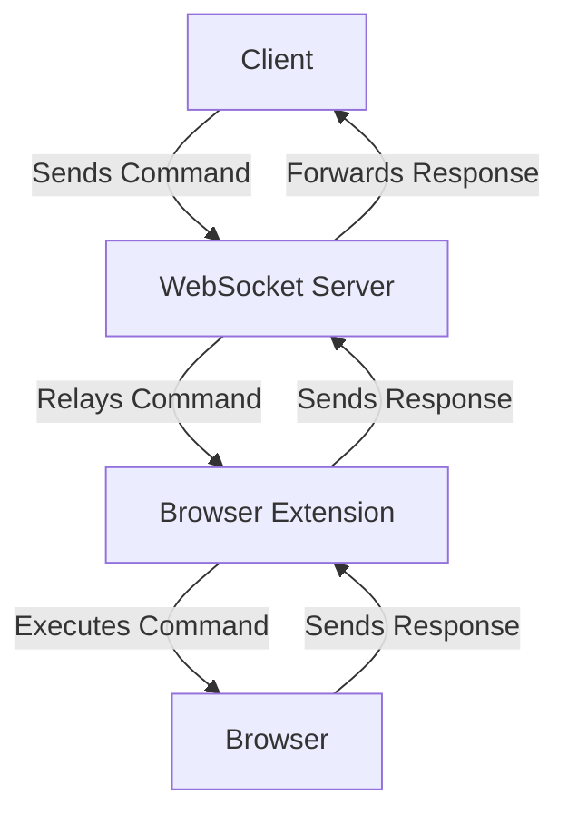
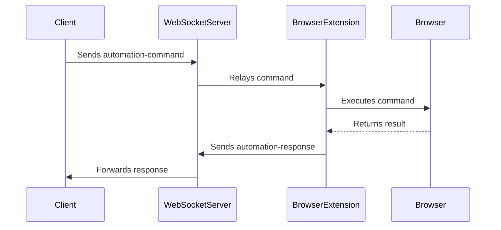
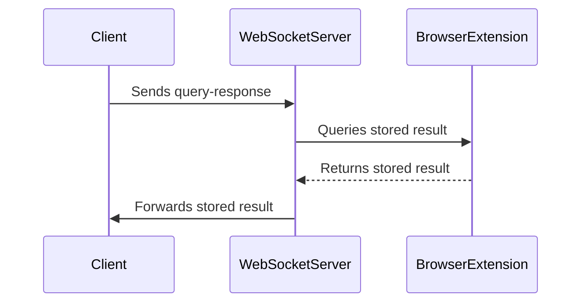

# Architecture Software Document

## Overview
This document describes the architecture of a browser automation system that allows clients to send commands to a browser extension via a WebSocket server. The system is composed of three main components:
1. **send_command.py**: A Python script that sends commands to the WebSocket server.
2. **background.js**: The background script of the browser extension that processes commands and interacts with the browser.
3. **src/server/server.js**: The WebSocket server that relays commands and responses between clients and the browser extension.

The system architecture can be visualized using Mermaid diagrams to illustrate the flow of commands and responses.

## Mermaid Diagrams

### High-Level Architecture

### Command Flow

### Query Flow

## Detailed Component Descriptions

### 1. send_command.py

#### Purpose
The `send_command.py` script is a command-line interface (CLI) tool that allows users to send browser automation commands to the WebSocket server. It also provides functionality to query the server for stored responses using a request ID.

#### Key Features
- **Command Sending**: Sends commands such as taking screenshots, navigating to URLs, and interacting with web elements.
- **Response Handling**: Processes and displays the responses received from the server.
- **Querying**: Allows users to query stored results using a request ID.

#### Code Structure
- **Imports**: Essential libraries such as `argparse`, `websockets`, `asyncio`, `uuid`, and `logging`.
- **Logging**: Configures logging for debugging and information tracking.
- **Functions**:
  - `generate_request_id()`: Generates a unique request ID.
  - `save_screenshot()`: Saves a base64-encoded screenshot to a file.
  - `handle_response()`: Processes and displays the response from the server.
  - `send_message()`: Sends a JSON message over the WebSocket.
  - `wait_for_automation_response()`: Waits for a response from the server.
  - `automation_command()`: Sends an automation command and handles the response.
  - `query_response()`: Queries the server for a stored result.
  - `main()`: Parses command-line arguments and initiates the command or query.

### 2. background.js

#### Purpose
The `background.js` script is the background script of the browser extension. It listens for WebSocket messages from the server, processes automation commands, and interacts with the browser to execute these commands.

#### Key Features
- **WebSocket Communication**: Manages the WebSocket connection to the server.
- **Command Execution**: Executes commands such as taking screenshots, navigating to URLs, and interacting with web elements.
- **Content Script Injection**: Injects content scripts into web pages as needed.
- **Response Handling**: Sends responses back to the server after executing commands.

#### Code Structure
- **Logging**: Provides logging functions for information and error tracking.
- **WebSocket Management**: Handles WebSocket connection, reconnection, and message processing.
- **Command Execution**:
  - `captureVisibleTab()`: Captures a screenshot of the visible tab.
  - `injectContentScriptIfNeeded()`: Injects content scripts into web pages.
  - `sendMessageToContentScript()`: Sends messages to content scripts.
  - `processCommand()`: Processes automation commands received from the server.
- **Response Handling**: Sends responses back to the server after executing commands.

### 3. src/server/server.js

#### Purpose
The `server.js` script is the WebSocket server that relays messages between clients and the browser extension. It also stores automation responses for later retrieval.

#### Key Features
- **Message Relaying**: Relays commands from clients to the browser extension and responses from the extension to clients.
- **Response Storage**: Stores automation responses with a time-to-live (TTL) for later retrieval.
- **Extension Management**: Manages the registration and status of the browser extension.
- **Heartbeat Monitoring**: Monitors the heartbeat of the extension to ensure it is still connected.

#### Code Structure
- **Imports**: Essential libraries such as `ws`, `dotenv`, and path utilities.
- **Logging**: Provides logging functions for information and error tracking.
- **WebSocket Server**: Manages WebSocket connections and message handling.
- **Extension Management**: Handles extension registration and status updates.
- **Response Storage**: Stores and retrieves automation responses.
- **Heartbeat Monitoring**: Monitors the heartbeat of the extension to ensure it is still connected.

## Conclusion
This document provides a detailed overview of the architecture and components of the browser automation system. The Mermaid diagrams illustrate the flow of commands and responses between the client, WebSocket server, and browser extension. Each component plays a crucial role in ensuring the system functions correctly and efficiently.