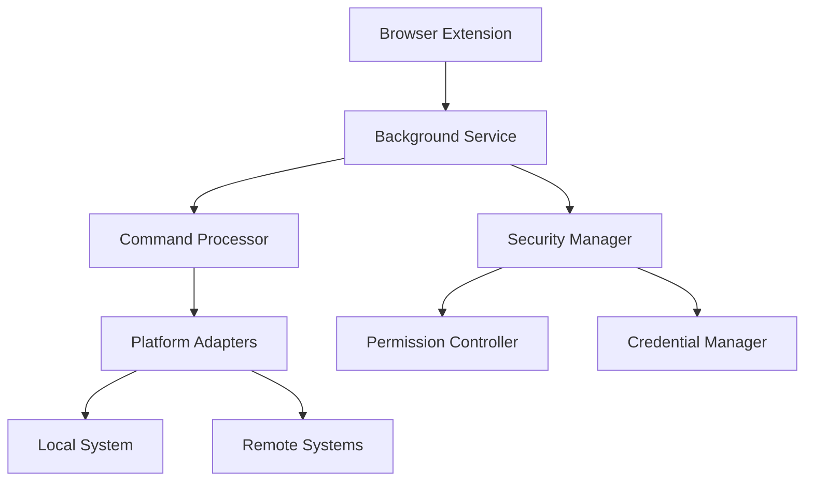
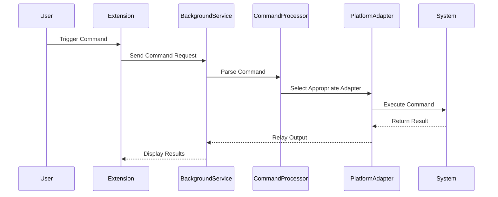

# QBrowser: Intelligent Command Execution Browser Extension

## Overview

QBrowser is an innovative browser extension that revolutionizes command execution by providing an intelligent, context-aware interface for running commands across different platforms and applications.

## 🌟 Key Features

- **Cross-Platform Command Execution**: Run commands seamlessly across various environments
- **Intelligent Context Parsing**: Automatically understands and suggests relevant commands
- **Secure Command Management**: Advanced security and permission handling
- **Extensible Architecture**: Easily extendable to support new command types and integrations

## 🏗️ System Architecture

### High-Level Architecture

### Command Execution Workflow

## 🛠️ Technical Components

### Core Technologies
- **Browser Extension**: Developed using Web Extensions API
- **Backend**: Node.js WebSocket and REST API server
- **Security**: API key-based authentication
- **Cross-Platform Support**: Python-based command transmission

### Key Modules
1. **Background Service** (`background.js`)
   - Manages Chrome extension lifecycle
   - Handles WebSocket communication
   - Implements command processing and routing
   - Provides logging and notification mechanisms
   - Manages browser tab and screenshot interactions

2. **Server Module** (`server.js`)
   - Implements WebSocket and REST API endpoints
   - Manages in-memory command queue
   - Provides API key authentication
   - Handles command processing and result tracking
   - Implements answer cleanup and expiration

3. **Command Sending Mechanism** (`send_command.py`)
   - Python CLI for sending browser automation commands
   - Supports various actions: screenshots, HTML retrieval/sending
   - Implements request tracking and polling
   - Provides comprehensive logging
   - Handles base64 screenshot saving

## 🔒 Security Considerations

- Implement strict permission controls
- Secure credential management
- Sandboxed command execution environment
- Comprehensive logging and audit trails

## 🚀 Getting Started

### Prerequisites
- Modern web browser (Chrome, Firefox, Edge)
- Python 3.8+
- Node.js 14+

### Installation
1. Clone the repository
2. Install dependencies: `npm install`
3. Load extension in browser's developer mode
4. Configure platform-specific settings

## 🤝 Contributing

1. Fork the repository
2. Create feature branches
3. Submit pull requests
4. Follow coding standards and security guidelines

## 📄 License

### Quantalogic Software License

**Software License Agreement**

#### Licensing Model

This software is provided under a flexible licensing model that encourages innovation while protecting core intellectual property.

#### Permissions

1. **Use**:
   - Free for non-commercial and personal use
   - Commercial use requires a separate licensing agreement
   - Educational and research institutions welcome

2. **Modification**:
   - Users may modify the software for personal or internal use
   - Derivative works must acknowledge the original source
   - Major modifications should be contributed back to the community

3. **Distribution**:
   - Redistribution allowed with attribution
   - Must include original copyright notice
   - No warranty is implied or provided

#### Restrictions

- Commercial exploitation requires written permission
- Core algorithms and unique implementations remain proprietary
- Trademark usage is not permitted without explicit consent

#### Intellectual Property

- Original source code and unique implementations are property of Quantalogic
- Contributions may be incorporated into future versions

#### Community & Collaboration

We encourage:
- Bug reports and feature suggestions
- Community-driven improvements
- Responsible disclosure of security issues

#### Contact

For licensing inquiries or collaboration:
- Email: opensource@quantalogic.com
- GitHub: [Quantalogic Open Source](https://github.com/quantalogic)

**© 2025 Quantalogic. Some Rights Reserved.**

*Inspired by the spirit of open innovation*

## 📞 Support

For issues, feature requests, or contributions, please open a GitHub issue or contact the maintainers.